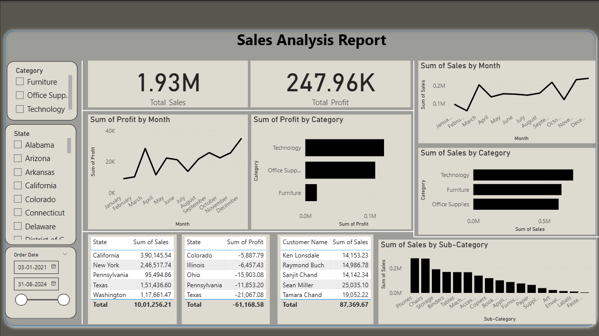

# 📊 Sales Analysis Report — Power BI

This repository contains a complete **Sales Analysis Report** built using Power BI, based on the **Sample - Superstore** dataset.  
The report provides insights into sales performance, profitability, regional trends, and product-level metrics.

---

## 🗂️ Project Files

| File Name | Description |
|----------|-------------|
| **Sample - Superstore.xls** | Dataset used for the report (Superstore sample dataset) |
| **_Sales_Analysis_Report_Power_BI_Project_1_.pbix** | Main Power BI report file |

---

## 🎯 Objective
To analyze business performance through an interactive Power BI report that highlights **sales**, **profit**, and **operational KPIs** for strategic decision-making.

---

## 📈 Key Insights Included in the Report
- **Total Sales & Total Profit Overview**  
- **Monthly Revenue Trends**  
- **Region-wise Sales Performance**  
- **Product Category & Subcategory Contribution**  
- **Operational Metrics & KPIs**  

---

## 🛠️ Techniques & Tools Used
### **Power Query**
- Data cleaning  
- Handling nulls, formatting, transformations  

### **DAX (Data Analysis Expressions)**
- KPI calculations  
- Custom measures (Sales, Profit, Profit Ratio, etc.)  

### **Report Visuals**
- Bar Charts  
- Line Charts  
- Cards  
- Slicers  
- Matrix tables  

---

## ▶️ How to Open the Report
1. Download the `.pbix` file:  
2. Open using **Power BI Desktop**  
3. Ensure the dataset file (`Sample - Superstore.xls`) is in the same folder OR relink the data source through **Power Query** if needed.

## 📊 Report Preview

## 👤 Author
**Nalgar Ahmed Faheen**  
🔗 LinkedIn: *https://www.linkedin.com/in/nalgar-ahmed-faheen-2a28b022a*  
📧 Email: *ahmedfaheen546@gmail.com*
